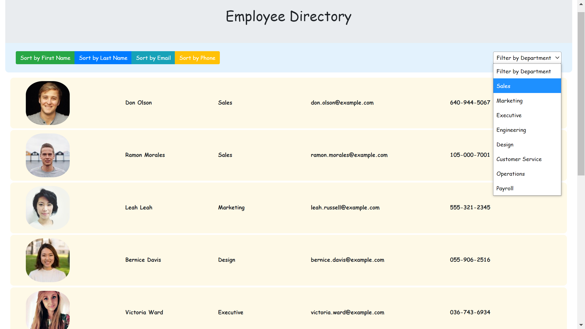

# Employee Directory – React App

## Description

This Employee Directory application is created with `React`. This application is able to render a list of employees with their basic information (image, name, department, email, and phone number), when the user loads the page.

User is able to sort the employees either in ascending or descending order by first name, last name, email, and phone number when clicking each functional button. User also can view employees in a specific department by clicking the drop down form to filter the employee departments.

## Table of Contents

- [Technologies](#Technologies)
- [Deployed with gh-pages](#Deployed-with-gh-pages)
- [Screenshot](#Screenshot)
- [License](#license)
- [Questions](#questions)

## Technologies

- This application was built in `React functional components` with `React Hooks` like `useState`.
- `Bootstrap` framework was utilized along with `React`.

## Deployed with gh-pages

The application was created with `create-react-app` and is deployed to `GitHub pages` here: https://aprilyanggarwood.github.io/React-employee-directory-app

## Screenshot

## License

## Questions?

If you want to know me and have questions about this app, please feel free to reach me via the link of my [GitHub](https://github.com/aprilyanggarwood) repository and my Email: <aprilyanggarwood@gmail.com>
